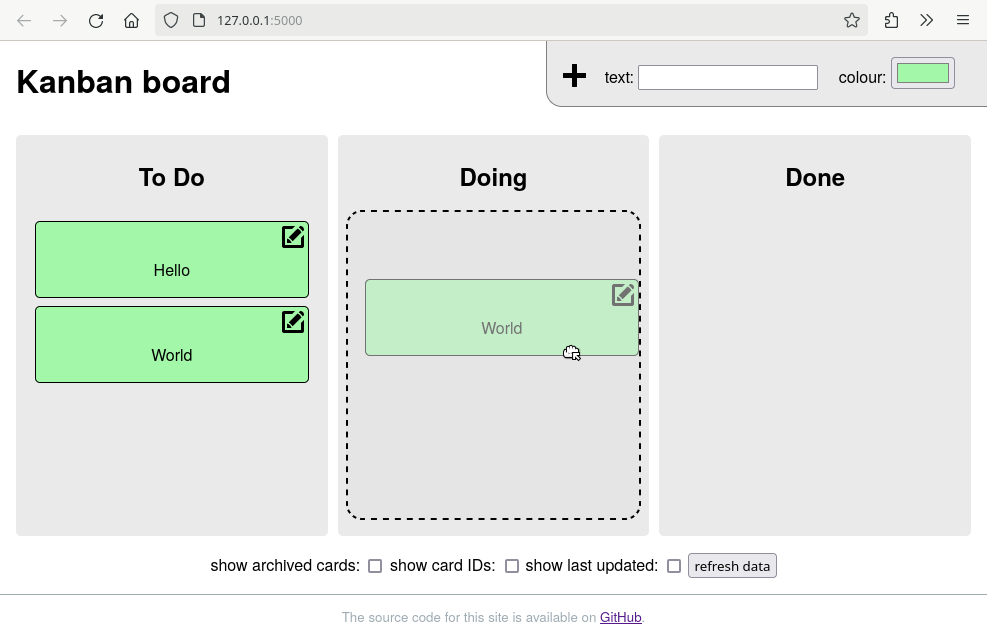

# Python Kanban Board

A simple Kanban board application using [Flask][flask-home] and [SQLite][sqlite-home].



---

## Table of Contents

- [Running Locally](#running-locally)
- [Overview](#overview)
- [Project Structure](#project-structure)
- [How It Works](#how-it-works)
- [Safe Code Modifications](#safe-code-modifications)
- [Database Requirements](#database-requirements)
- [Integrating Into Other Projects](#integrating-into-other-projects)
- [License](#license)

---

## Running Locally

The application can be run with the following steps:

1. **Install required python packages**:

    ```bash
    pip install -r requirements.txt
    ```

    > **Note**: this will install packages globally. To avoid changing the system packages, the [venv module][venv-docs] can be used to set up a virtual environment.

2. **Run the application using `flask`**:

    ```bash
    FLASK_APP=main.py flask run
    ```

3. Finally, connect to [http://127.0.0.1:5000/](http://127.0.0.1:5000/) in a web browser.

---

## Overview

This is a simple Kanban board application built using Flask and SQLite. The application allows users to create, update, delete, and reorder cards within predefined columns on a Kanban board.

---

## Project Structure

The project consists of three main files:

1. **`main.py`** – The core application logic and route definitions.
2. **`cards.py`** – The model and functions for managing Kanban cards.
3. **`database.py`** – Handles the database instance using SQLAlchemy.

---

## How It Works

### `main.py`

This file sets up the Flask application and handles routes for card management.

- **Routes**:
  - `/`: Return Kanban board index page
  - `/static/<file:path>`: Return static files from the `static` directory (CSS, JS etc)
  - `/cards`: Returns all cards in JSON format.
  - `/columns`: Returns available columns.
  - `/card`: POST endpoint to create a new card.
  - `/card/<int:card_id>`: PUT to update or DELETE to delete a card.
  - `/card/reorder`: POST to reorder cards within the board.

### `cards.py`

This file contains the **Card** model and its associated functions. It includes creating, updating, deleting, and reordering cards.

- **Key Functions**:
  - `all_cards()`: Fetch all cards, sorted by `sort_order`.
  - `create_card()`: Create a new card with optional fields like color and column.
  - `update_card()`: Update an existing card's attributes.
  - `delete_card()`: Delete a card.
  - `order_cards()`: Reorder a card in the list.

The **Card** model is defined with attributes like `id`, `text`, `column`, `color`, `modified`, `archived`, and `sort_order`. Cards are uniquely identified by `id`, and columns specify the status of a card.

### `database.py`

This file initializes the SQLAlchemy instance and connects to an SQLite database. The configuration is flexible to accommodate different databases as needed.

---

## Safe Code Modifications

### Key Variables

- **`id`**: Unique identifier for each card (primary key).
- **`text`**: The content of the card (free text).
- **`column`**: Defines which column the card belongs to (predefined options).
- **`color`**: Color of the card, in `#RRGGBB` format.
- **`modified`**: Auto-updated timestamp when a card is modified.
- **`archived`**: Boolean indicating if a card is archived.
- **`sort_order`**: Determines the order in which cards are displayed in each column.

### Key Considerations

- The `id` field must be unique.
- Ensure the `column` value is valid (exists in the list of predefined columns set by the `kanban.columns` config option).

---

## Database Requirements

The application uses **SQLite** managed through **SQLAlchemy**. The main table `Card` includes the following columns:

| Column      | Type         | Description                                    |
|-------------|--------------|------------------------------------------------|
| id          | Integer (PK) | Primary key for each card                      |
| text        | String(120)  | The card's content                             |
| column      | String(120)  | The card's column (e.g., "To Do", "Done")      |
| color       | String(7)    | Color code in `#RRGGBB` format                 |
| modified    | DateTime     | Last modification timestamp                    |
| archived    | Boolean      | Indicates if the card is archived              |
| sort_order  | Integer      | Order of the card within the column            |

---

## Integrating Into Other Projects

To integrate this Kanban board into another project:

### 1. **Setup Flask and SQLAlchemy**

Ensure Flask and SQLAlchemy are installed. You can use the following:

```bash
pip install flask sqlalchemy
```

### 2. **Database Configuration**

Ensure that the `SQLALCHEMY_DATABASE_URI` in your project points to a valid database:

```python
app.config['SQLALCHEMY_DATABASE_URI'] = 'sqlite:///your_project.db'
```

### 3. **Models and Routes**

Integrate the `Card` model and the routes from `main.py`.

---

## License

With the exception of the following, all code in this repository is released under the terms of the [GNU General Public License v3][gpl-v3]:

- [Plus][plus-icon] and [Edit][edit-icon] icons were created by Andrian Valeanu, and are available under the [Creative Commons (CC BY-NC 3.0)][cc-by-nc-3.0] license.
- [Vue.js][vuejs-home] is released under the [MIT License][mit-license].
- [DragDropTouch][dragdroptouch-home] is released under the [MIT License][mit-license].

---

[cc-by-nc-3.0]: https://creativecommons.org/licenses/by-nc/3.0/
[dragdroptouch-home]: https://github.com/Bernardo-Castilho/dragdroptouch
[edit-icon]: https://www.iconfinder.com/icons/103173/edit_new_write_icon
[flask-home]: http://flask.pocoo.org/
[gpl-v3]: https://www.gnu.org/licenses/gpl-3.0.en.html
[mit-license]: https://opensource.org/licenses/MIT
[plus-icon]: https://www.iconfinder.com/icons/103172/add_plus_icon
[sqlite-home]: https://www.sqlite.org/
[venv-docs]: https://docs.python.org/3/library/venv.html
[vuejs-home]: https://vuejs.org/
